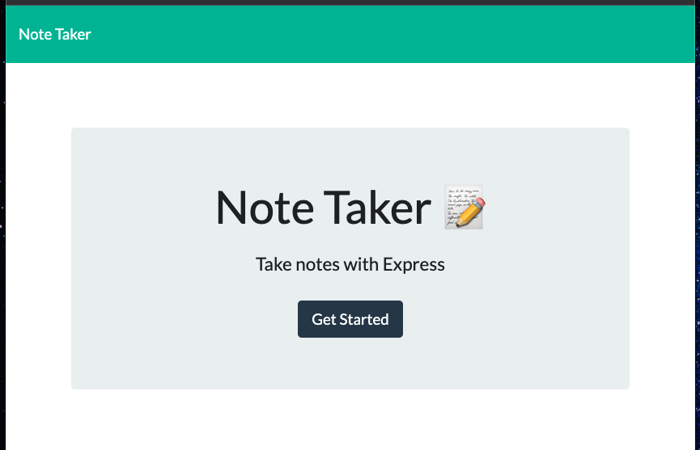
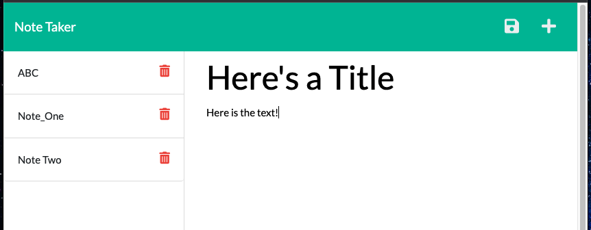

# My_Note_Taker_11.1

## Title: The Personal Note Taking Web App
 

## Description:
This is a Note Taker App that can be used to write, save, and delete notes. This application uses an Express.js back end to save and retrieve note data from a JSON file. It is deployed live with Heroku (see link below).
  

## Links:  
repo: https://github.com/xnd0/My_Note_Taker_11.1
 
live: https://quiet-thicket-39629.herokuapp.com/
  

## Screenshots:

 

## Technologies Used:
Javascript, CSS, HTML, Bootstrap, Express, Node, Heroku